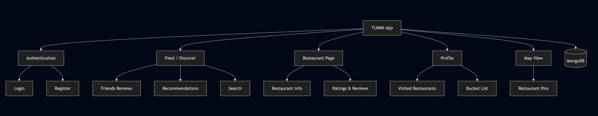
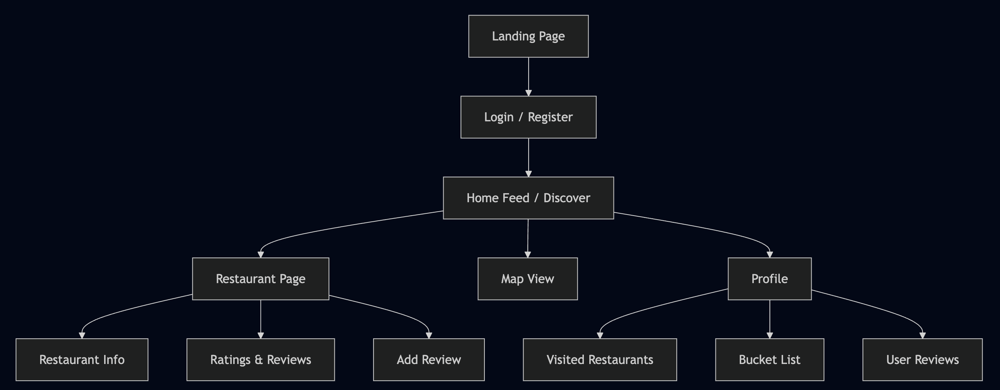

## <b> TUMMI </b>

### TARGET SHIP DATE: 2026-06-01

### Roster + Roles:

| Name | Email | Primary Role | Secondary Role |
|---|---|---|---|
|Sean Takahashi(PM)|seanyutot@nycstudents.net| Flask | Review + Profile|
|Kalimul Kaif|kalimulk@nycstudents.net| Restaurant map| HTML|
|Evan Khosh|evank43@nycstudents.net|MongoDB| Maintenance of VM/publicly facing site|
|Thomas Mackey|thomasm292@nycstudents.net| Gather data of all nearby food locations| Populate DB with reviews|

### Overview:
tummi will be a beli-clone that specifically caters towards Stuy students. On the app, users will be able to explore a map of restaurants/food options near Stuy and see other users' reviews of them. Users will also be able to add restaurants to the map or remove them to reflect new restaraurnt openings/closings. By registering an account, users will be able to leave ratings and reviews of restaurants and also create lists of places they want to try. On their profile, users will be able to see all the restaraunts they've reviewed and the places they want to try in both map and list forms.

## Problem Being Solved
Many students around stuy don't know where to go when going out for lunch or just keep on going to the same place over and over again. With tummi, stuy students who love food but don't know where to go for lunch will be able to learn about a variety of places to eat which they may have not known about earlier and try new things. 

## Target Users

- Food Reviewers: Primarily to review restaurants and add new restaurants
- Regular Diners: Primarily to find good restaurants to eat at

## Why This Project Matters
Tummi will be able to give students who love food access to many resturants, delis, or shops that they might've not known about before, allowing these students to try new things. This project is for users who love eating and tired of going to the same place for lunch over and over again. 

---

# Minimum Viable Product (MVP) Scope

## Core Features (Required for Final Submission)
Features that **must** be completed:
1. Map containing all the restaurants in the area around stuy
2. Review function where users can add reviews to restaurants
3. Users can create list of restaurants of what they want to try

## Stretch Features (Only if MVP is Complete)
1. Users can add restaurants or food carts not listed
2. Users can view other users' profiles and see their reviews as well as the list of what they want to try
3. Ranking of most reviewed/visited
4. Users can delete restaurants/food carts no longer open(possibly multiple user verification system?)

## Explicit Non-Goals
Features intentionally excluded:
- eg0
- eg1

---

# Technology Stack

| Layer | Selected Tool |
|---|---|
| Backend Framework | Flask |
| Frontend Framework | Tailwind CSS |
| Database | MongoDB |
| Authentication | Flask Sessions |

## Why This Stack Was Chosen

We will be using Flask as our Backend Framework because it is what all members of the team are most experienced with and it will fulfill the purpose we need it to for this project. We will be using Tailwind CSS as our Frontend Framework because of team experience and aesthetic preference. We will be using MongoDB as out Database because a document-based database is more compatable for storing restaraunt  and review information which needs to be flexible and all bundled together as one document per restaurant. Evan also already worked on setting up MongoDB last project, so recreating the setup will take minimal time. We will be using Flask sessions as our Authentication because we do not have any strong requirements that would make it unviable.

---

# Team Ownership Plan

Each member must own meaningful deliverables.

| Team Member | Primary Ownership | Secondary Ownership | Specific Deliverables |
|---|---|---|---|
|Sean Takahashi(PM)| Flask | Review + Profile| Ability to rate restaurant and view profile with reviewed restaurants|
|Kalimul Kaif| Restaurant map| HTML| Functioning map showing all added restaurants; pages with explanation|
|Evan Khosh|MongoDB| Maintenance of VM/publicly facing site| Properly loading live site with all inputted data|
|Thomas Mackey| Gather data of all nearby food locations| Populate DB with reviews| Abundant amount of restaurants and some personal reviews of different restaurants|

---

# Component Map

- Feed: See where other users/friends have recently visited and ranked. 
- Profile: Displays restaurants visited for the user and locations in bucket list. 
- Review: Rate restaurant visit based on several categories and compare preference versus other visited restaurants. 
- Discover: Find the most fit restaurants taylored to the user based on similar likes from previously visited restaurants

# Site Map

## Key User Stories
### eg0
As a Stuy kid looking for a quick lunch between periods, I want to view a feed of my friends' recent ratings in the area so that I can quickly find a reliable, student-approved, and budget-friendly spot without wasting my break time.

### eg1
As a NYC college student who enjoys exploring diverse cuisines, I want to create and manage a bucket list of restaurants I want to visit and enjoy.

### eg2
As a foodie enthusiast, I want to rank my restaurant visits and compare them against my previous favorites so that I can build a leaderboard of the best spots I've been to.

# Database Design

# Testing Plan
Reviews: 
- Users can only edit own reviews, not others
- Can create multiple reviews of same restaurant
- Average calculation accuracy

Users: 
- Create 5+ testing user accounts
- Verify session persisting after reload
- Verify app not allowing nonregistered users
- Simulatenously enact multiple actions(reviews, adding to bucket list, etc.) and confirm changes reflected from view of other users

Restaurants:
- Add 15+ restaurants
- Verify added restaurants appear correctly+same for all users
- Proper loading of restaurant reviews post click of marker
- Play around with pan out/in functionality to make sure all intact
- Ensure duplicate restaurants not added
- No duplicacy of bucket list restaurants, restaurants visited

# Timeline
## Week 1 Goals: Core Infrastructure
Sean: 
- Session authentication + login/out
- Basic profile page
- Base restaurant schema

Kalimul:
- Interactive map around Stuy
- Restaurants pulled from MongoDB, displayed as markers
- Marker displays basic info

Evan:
- MongoDB setup(user and restaurant collections)
- VM properly loading Flask app
- README edited for instructions intented for developers deploying app

Thomas:
- Gather nearby restaurants
  - Include name, cuisine, address, coordinates, price range, image
- Go to some restaurants and input reviews for testing

## Week 2 Goals: MVP Features
Sean:
- Users can create, edit, delete reviews
- Restaurant page properly displays all user reviews
- Determine whether users can still see reviews they made for deleted restaurants, test accordingly
- Average rating calculation

Kalimul:
- Tailwind implementation
- Navbar
- Restaurant cards
- Easy visibility of map, restaurant info
- Consistency across different window sizes

Evan:
- Saving restaurants to profile/bucket list
- Optimize restaurant queries
- Assist category and filtering for map/search

Thomas:
- Add more reviews and locations(~15 locations, ~10 reviews)
- Add category tags to restaurants(cuisine, average service speed reported range, ratings, etc.)
- Filtering restaurants by category

## Week 3 Goals: Stretch features, integration, testing, recording
- Finish components unfinished from previous weeks
- Test whole user navigation flow(register, login, search restaurant on map, review restaurant, add restaurant, delete restaurant, etc.)
- Simultaneous testing on public facing site
- Other stretch features
- Recording of demo video

# Completion Criteria (_a.k.a._ "Definition of 'Done'")
Project is considered complete when all of the following are true:
1. MVP features are implemented (auth, discover, restaurant pages with reviews, profile with bucket list, map view)
2. Frontend, backend and MongoDB are fully integrated
3. Internet-facing app is deployed and stable with no critical bugs

---
